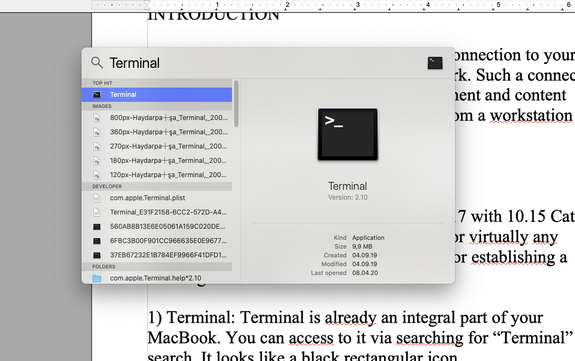
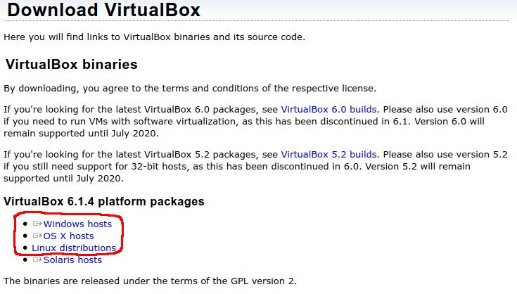
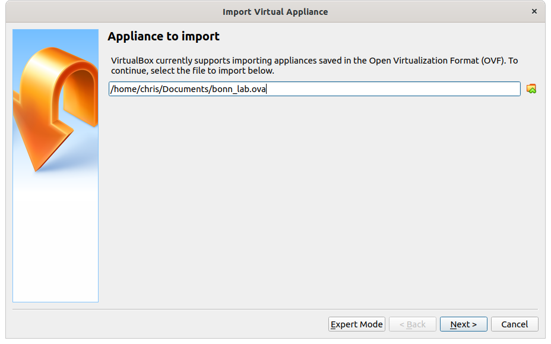
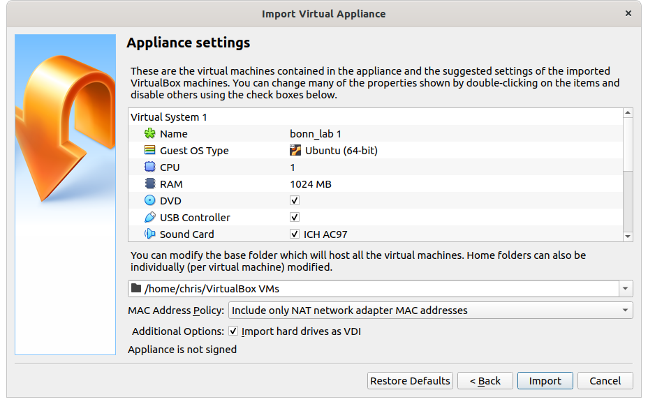
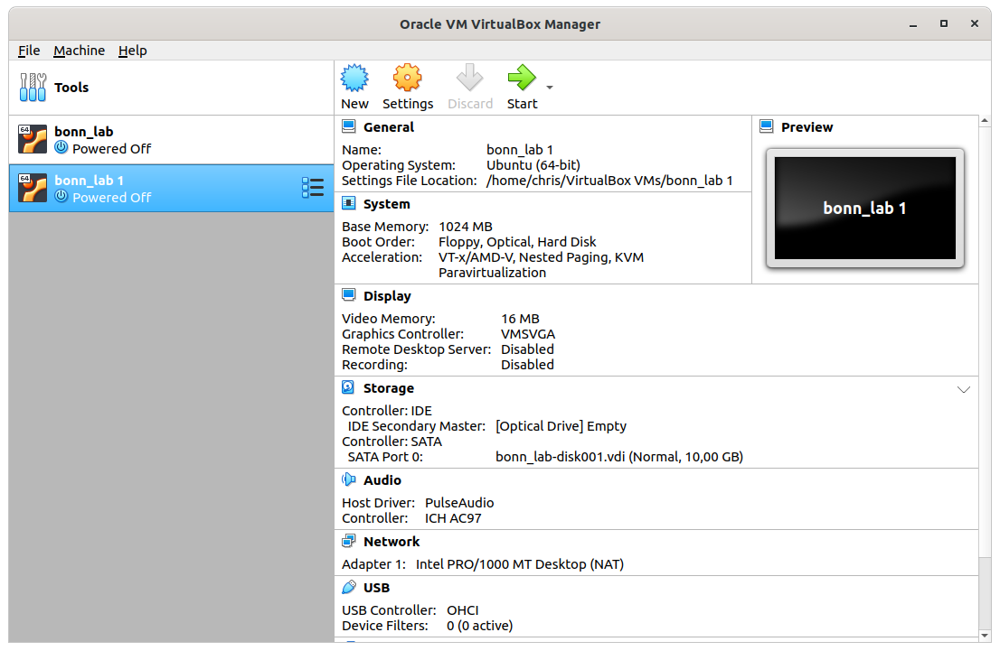
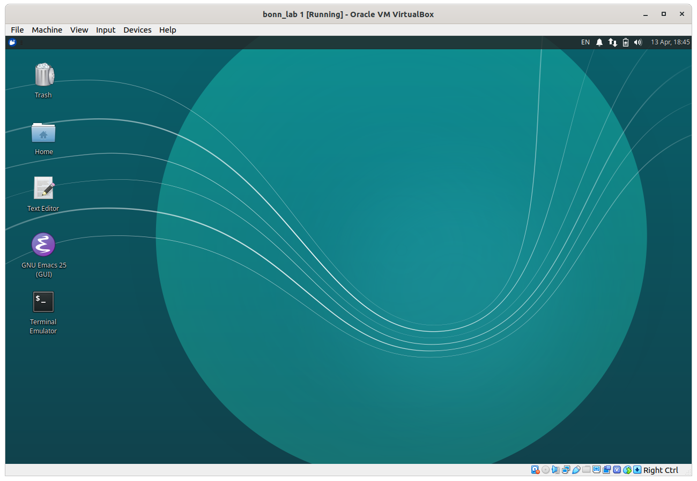

# Instructions for remote laboratory courses (ATLAS & Z0)

These are some basic instructions to guiding you to perform the ATLAS and Z0
laboratory courses. Please contact the tutors responsible for your experiment if
you have any questions or need clarifications.

Also ensure that you have a functioning setup about a week in advance of the lab
course date.

## Running the analysis software

### Option 1: X-forwarding

This section explains how to make a SSH connection to your uni-id account from
out of the university network. Such a connection amounts to accessing the
software environment and content similar to what you have when you login from a
workstation in the university.

First of all make sure you have a working Uni-ID from University of Bonn that
you can login to the provided services of the university.

#### Windows

#### Linux

Any Linux system should come preinstalled with a SSH client. To log in to the PI
servers type:

```bash
ssh -X my_uni_id@desktop.physik.uni-bonn.de
```

where `my_uni_id` is your University ID (e.g. starting with `s6` if you are
enrolled in the science/math department). For more tips on how to transfer files
using `scp` see also the instructions for Mac OS X.

#### Mac OS X

**Setup and necessary tools:**

This tutorial is tested in a MacBook Air 2017 with 10.15 Catalina setup, but the
same structure should work for virtually any version. Two software tools are
necessary for establishing a working connection:

1. Terminal: Terminal is already an integral part of your MacBook. You can
   access to it via searching for “Terminal” at the search. It looks like a
   black rectangular icon.
   


We will use the terminal to execute all the commands concerning the
opening/closing/accessing to the programs, files etc. The Terminal is a purely
text based interface itself but it can be used to access to graphical display
tools. For our experiment we also need to be able to open images and plots we
have drawn. This brings us to second tool we need, Xquartz.

2. Xquartz: Xquartz is the official X Server for the mac OS. This tool is needed
   to give the Terminal capability to work with graphical file formats such as
   images or GUIs. Unlike Terminal, Xquartz does not come as an integral part of
   MacBook OS, so you need to download and install it. It can be downloaded from
   here: [XQuartz](https://www.xquartz.org)


**Login and work:**

Now that we have the tools ready, we can begin our work. We first need to login
to our Uni-ID based university desktop

Open a terminal. Type:
```bash
ssh -XY my_uni_id@desktop.physik.uni-bonn.de
```

You will be asked to enter your password, type it and press `Enter`. If all goes
well, you are now at the home directory of your university account. You can type
`ls` and press Enter to see what is in the directory.

Among them you should see `Desktop`.

Lets go there: Type `cd Desktop` and press `Enter`. Now you should be in your
Desktop folder.

Now lets copy the folder containing files needed for the *Z0 experiment* into our
Desktop folder:

```bash
cp -r /gpfs/share/home/ooencel/Public/Z0Exp .
```

Please notice the space after Z0Exp before the dot. Now you should have the
folder on your own Desktop.

For the *ATLAS experiment*, the tutor will provide you with a link to download the
data.

From here on you can follow the instructions from the normal experiment manual
with the exception that, whenever you need to open an image file you need to use
the command evince and type enter such as `evince image.pdf`.

For the first part of the experiment, the event displays; it might be easier for
you to download the image sets to your laptop and do it there. For this you can
simply create a new folder on your laptop and in this folder right click and
“Open Terminal Here”. You will have a terminal opened in this folder. Now you
can type:

```bash
scp -r my_uni_id@desktop.physik.uni-bonn.de:location_of_folder .
```

where the location of folder can be found by going to Event Displays Folder from Desktop: 

```bash
cd Z0Experiment
cd Event Displays
```

and now type `pwd` and click enter.
You will get something like that: `/gpfs/share/home/ooencel/Public/Z0Exp/EventDisplay/`

So the final command to copy the files should have a structure like: 

```bash
scp -r ooencel@desktop.physik.uni-bonn.de:/gpfs/share/home/ooencel/Public/Z0Exp/EventDisplay/ .
```

### Option 2: Virtual Machine

You can use a virtual machine (VM) as an alternative in case X-forwarding does
not work for you or your internet connection is too slow. We provide an
preconfigured 'appliance' that you can run using
[VirtualBox](https://www.virtualbox.org/). Please note that running a VM
requires a decent computer (and quite some disk space) therefore we suggest that
you try X-forwarding first but feel free to use this method if you have prior
experience with VMs.

To run the appliance need to download VirtualBox and install it on your
computer. VirtualBox is available for all major operating systems (e.g. Windows,
OS X, and Linux) on the [VirtualBox Downloads
page](https://www.virtualbox.org/wiki/Downloads).



You can download the ATLAS & Z0 appliance [here (4.2
GB)](https://uni-bonn.sciebo.de/s/t3IsIU8bMMWik7Q).

#### Setting up the appliance

The following instructions have been tested with VirtualBox 6.0.14 on a Linux
system. Some things might be named a little differently if you are running a
different version or operating system.

1. Start VirtualBox and go to `File > Import Appliance`
2. Select the appliance in `OVF` format that you downloaded from sciebo and click `Next`
3. The next window gives you the option to change the appliance settings. The
   defaults should be fine to use for the lab. Note that you can also change the
   directory where the VM is stored. Click `Import` after you are done changing
   the settings.
4. The appliance will show up in the VirtualBox Manager. Select it and press `Start`.
5. A window will show up with the graphical output of the VM.







#### Getting data off the VM

You can use any online file sharing service (e.g. sciebo, e-mail, ...) to get
the data you need for the report off the VM.

## Collaborating with your lab partner

### Using skype to collaborate with your lab partner
To install Skype, follow [link](https://www.skype.com/en/get-skype/download-skype-for-desktop/)

Keeping the fact that students and tutor have a Skype app already installed on
their respective devices/laptops and have a Skype account, the easiest way to
collaborate will be to create a Skype group with name of the chat group set as
the group name, for e.g: “E213: PXX”.

a. The students should send in their Skype id’s to the tutor before the
scheduled lab date, so that the tutor can make a Skype group and add both the
students. The tutor will initiate the group call at the scheduled lab time,
predecided by the students and the tutor, and will explain/ instruct the
students about the lab course/ tasks that they have to perform on the day and
any instructions in general.

b. This skype group is only for collaboration/ discussion among the students
while doing the lab course, for e.g. if the two students need to discuss
something, share some plots etc. This can be effectively done via the screen
sharing option whose symbol is displayed while doing a group call and of course
they can send some plots etc. inside the normal chat also.

For screen sharing: follow [link](
https://support.skype.com/en/faq/FA34895/screen-sharing-in-skype)

c. If the students also want the tutor to join the call, to report/ clarify or
show them the progress, they can simply just leave a message on the group to
notify the tutor so that they can join/ initiate the call on time (For this the
tutors should be available online on Skype for most of the time during the day,
the lab is conducted).

d. The students should mutually agree between each other in presence of the
tutor (before the actual lab session starts) about the tasks they want to split,
so that they can simultaneously work on these tasks and discuss among each other
or with the tutor as described in point b and c respectively.

e. To end the lab session for the day, the students can simply message the tutor
for a group call and discuss the strategy for the next day.

### Using skype for oral exam:

a. The oral exam will be conducted separately for each student of the lab course
(for a period of 30 minutes?). The tutor will separately notify the students
regarding their individual time slot.

b. The tutor will contact the student on their respective time slot, and will
conduct the oral exam. This will be via a video chat

c. To conduct a fair exam, the students should give a scan of the room/place
they are sitting so as to ensure the tutor that no unforeseen cheating material
is used...(while I know this does'nt make sense ;))

d. If the oral exam requires the student to draw something, they can use the
Paint app (?**, open it on their screens, start the screen sharing option and
draw/represent accordingly whatever is asked by the tutor.

## Oral exam

The Oral exam takes place before the lab session begins. Originally this happens
before the whiteboard in the lab room where tutors and students interact face to
face. Given the current attempt at remote execution of labs, a substitute is
needed for conducting the oral exams as well as communicating during the lab
session. This basically requires a tool to communicate audiovisually, which we
choose to be Skype for it is commonplace and free, as well as a tool to
substitute for whiteboard, which we choose to use a free simple web-based
program called Whiteboardfox.

In order to run this examination session as smooth as possible the following
rules should be followed:

* The whole setup should be tested before the time of examination, you can test it together with your partner.
* Each lab member should be alone in a room, that is reasonably silent and well
  lit for tutors to be able to interact with you
* The usual rules for cheating / plagiarism applies to remote examination as it
  does in the face-to-face examination. This means getting help from friends /
  Google etc will result in a failing grade and disciplinary action. If tutors
  doubt something is going on they might require further evidence and/or cancel
  the session until a safer setting is established.


**Tools needed:**

1. Skype: Skype is a popular internet telecommunication program that can be used
to make telephone/video calls over internet. It can be downloaded from
https://www.skype.com/en/get-skype/download-skype-for-desktop/ . After the
download you will have to signup and register. Skype offers premium paid
features but for our purposes default free edition is enough. So you do not need
to go for any paid options to conduct the experiment.

2. Whiteboardfox: This is a web-based whiteboard app where tutors and students
can work together by drawing on a canvas realtime. The tutor will create a page
and share the link with you so both sides can access to same canvas. You do not
need to install any software to use whiteboardfox, just the browser. It is
accessible from https://whiteboardfox.com/


## Preparation for the oral exam / lab session

This section describes the preparation for the oral exam and lab session and how
the communication is going to take place during the execution of the lab.

1. Checks to be done before the day of experiment
    * Check with your partner that both of your Skype setups work. You can make
      a call to each other and test the stability of connection, quality of
      audio and video.
       
    * Check that you are able to access and use the Whiteboardfox. Go to
      Whiteboardfox webpage and try to make some simple drawing such as
      geometrical shapes, add some text, change the color (double click on draw
      to see color options), erase what you drew. You should also try to share
      your canvas with your partner (options->Share) to make sure sharing
      facility works for both of you.
      
    * Share your Skype IDs with your tutor and have theirs in return to make
      sure the connection can be established on the day of lab.
      
    * A powerful tool that can be used is the screenshare feature of Skype which
      can help tutor to understand your problem and/or to describe an issue. You
      can try and learn how to screenshare as a part of your preparation and
      test it with your partner over Skype call. Information on screensharing
      can be found here:
      https://support.skype.com/en/faq/FA34895/screen-sharing-in-skype

2. Communication During The Lab Session
    * The tutors will be available during the conduction of lab session for your
      questions and requests for help. This can be achieved with a Skype group
      consistent of students and the tutors. The tutor will setup a Skype group
      at the beginning of lab time.
      
    * Students can also have their own 1-to-1 private Skype chat for their
      collaboration where they do not need to consult something to the tutor.
    
    * Your tutor will be available and monitoring their Skype messages during
      the duration of lab session.
