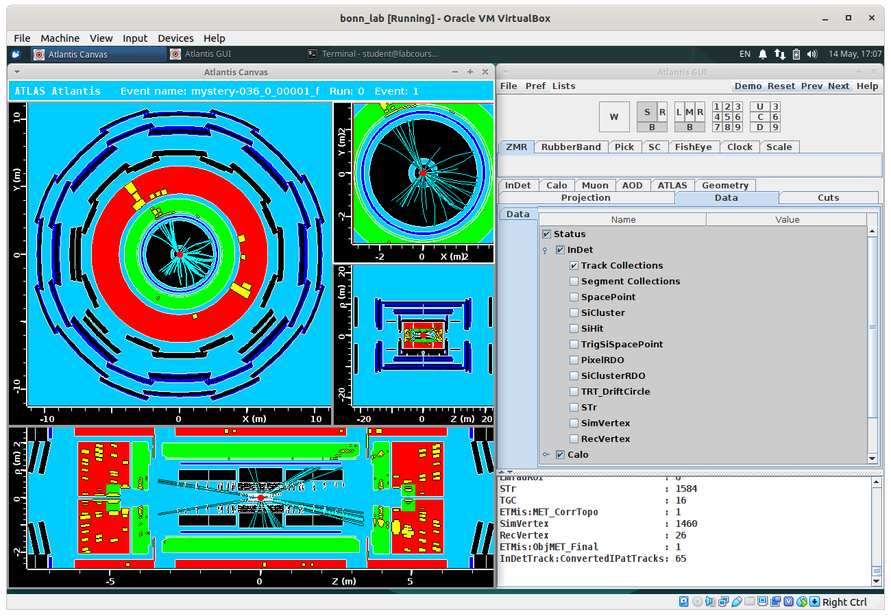
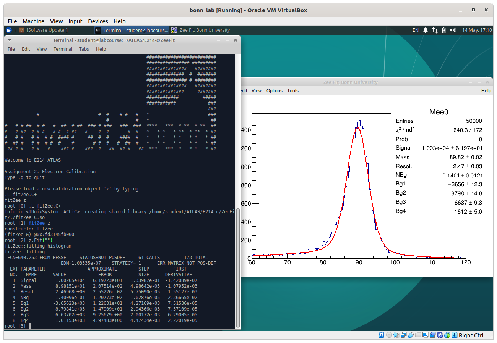

# Instructions for remote laboratory courses (ATLAS & Z0)

These are some basic instructions to guiding you to perform the ATLAS and Z0
laboratory courses. Please contact the tutors responsible for your experiment if
you have any questions or need clarifications.

Also ensure that you have a functioning setup about a week in advance of the lab
course date.

## Running the analysis software

### Option 1: X-forwarding

This section explains how to make a SSH connection to your uni-id account from
out of the university network. Such a connection amounts to accessing the
software environment and content similar to what you have when you login from a
workstation in the university.

First of all make sure you have a working Uni-ID from University of Bonn that
you can login to the provided services of the university.

#### Linux

Any Linux system should come preinstalled with a SSH client. To log in to the PI
servers type:

```bash
ssh -X my_uni_id@desktop.physik.uni-bonn.de
```

where `my_uni_id` is your University ID (e.g. starting with `s6` if you are
enrolled in the science/math department). For more tips on how to transfer files
using `scp` see also the instructions for Mac OS X.

#### Mac OS X

**Setup and necessary tools:**

This tutorial is tested in a MacBook Air 2017 with 10.15 Catalina setup, but the
same structure should work for virtually any version. Two software tools are
necessary for establishing a working connection:

1. **Terminal:** Terminal is already an integral part of your MacBook. You can
   access to it via searching for “Terminal” at the search. It looks like a
   black rectangular icon.
   


We will use the terminal to execute all the commands concerning the
opening/closing/accessing to the programs, files etc. The Terminal is a purely
text based interface itself but it can be used to access to graphical display
tools. For our experiment we also need to be able to open images and plots we
have drawn. This brings us to second tool we need, Xquartz.

2. **XQuartz:** XQuartz is a X-Server for the mac OS. This tool is needed to
   give the Terminal capability to work with graphical file formats such as
   images or GUIs. Unlike Terminal, XQuartz does not come as an integral part of
   MacBook OS, so you need to download and install it. It can be downloaded from
   here: [XQuartz](https://www.xquartz.org). Make sure to start XQuartz before
   initiating the ssh connection.


**Login and work:**

Now that we have the tools ready, we can begin our work. We first need to login
to our Uni-ID based university desktop

Open a terminal. Type:
```bash
ssh -XY my_uni_id@desktop.physik.uni-bonn.de
```

You will be asked to enter your password, type it and press `Enter`. If all goes
well, you are now at the home directory of your university account. You can type
`ls` and press Enter to see what is in the directory.

Among them you should see `Desktop`.

Lets go there: Type `cd Desktop` and press `Enter`. Now you should be in your
Desktop folder.

Now lets copy the folder containing files needed for the *Z0 experiment* into our
Desktop folder:

```bash
cp -r /cephfs/user/ooencel/E213 .
```

Please notice the space after E213 before the dot. Now you should have the
folder on your own Desktop.

For the *ATLAS experiment*, the tutor will provide you with a link to download the
data.

From here on you can follow the instructions from the normal experiment manual
with the exception that, whenever you need to open an image file you need to use
the command evince and type enter such as `evince image.pdf`.

For the first part of the experiment, the event displays; it might be easier for
you to download the image sets to your laptop and do it there. For this you can
simply create a new folder on your laptop and in this folder right click and
“Open Terminal Here”. You will have a terminal opened in this folder. Now you
can type:

```bash
scp -r my_uni_id@desktop.physik.uni-bonn.de:location_of_folder .
```

where the location of folder can be found by going to Event Displays Folder from Desktop: 

```bash
cd Z0Experiment
cd Event Displays
```

and now type `pwd` and click enter.
You will get something like that: `/cephfs/user/ooencel/E213/EventDisplay/`

So the final command to copy the files should have a structure like: 

```bash
scp -r ooencel@desktop.physik.uni-bonn.de:/cephfs/user/ooencel/E213/EventDisplay/ .
```

#### Windows

We recommend using *Option 2: Virtual Machine* instead of X-forwarding on
Windows due to the amount of configuration necessary to get X-forwarding to work
under Windows systems.

If you want to use X-forwarding on Windows we collected some basic instructions here:

[Instructions for Windows](X_Forwarding_Windows.md)

### Option 2: Virtual Machine

You can use a virtual machine (VM) as an alternative in case X-forwarding does
not work for you or your internet connection is too slow. We provide an
preconfigured 'appliance' that you can run using
[VirtualBox](https://www.virtualbox.org/). Please note that running a VM
requires a decent computer (and quite some disk space) therefore we suggest that
you try X-forwarding first but feel free to use this method if you have prior
experience with VMs.

To run the appliance need to download VirtualBox and install it on your
computer. VirtualBox is available for all major operating systems (e.g. Windows,
OS X, and Linux) on the [VirtualBox Downloads
page](https://www.virtualbox.org/wiki/Downloads).


You can download the ATLAS & Z0 appliance [here (4.3
GB)](https://uni-bonn.sciebo.de/s/t3IsIU8bMMWik7Q).
The login password for the VM is `bonn2021` in case you need it
(you should be automatically logged in).

#### Setting up the appliance

The following instructions have been tested with VirtualBox 6.0.14 on a Linux
system. Some things might be named a little differently if you are running a
different version or operating system.

1. Start VirtualBox and go to `File > Import Appliance`
2. Select the appliance in `OVF` format that you downloaded from sciebo and click `Next`
3. The next window gives you the option to change the appliance settings. The
   defaults should be fine to use for the lab. Note that you can also change the
   directory where the VM is stored. Click `Import` after you are done changing
   the settings.
4. The appliance will show up in the VirtualBox Manager. Select it and press `Start`.
5. A window will show up with the graphical output of the VM.





#### Getting data off the VM

You can use any online file sharing service (e.g. sciebo, e-mail, ...) to get
the data you need for the report off the VM.

## Collaborating with your lab partner

We are recommending to use Zoom to collaborate with your lab partner. The Zoom
portal of the University of Bonn can be found [here](https://uni-bonn.zoom.us/).

The supervising tutor will create a room and send you the connection details.

1. Make sure you are familiar with and tested the screensharing and whiteboard
   features of Zoom. This helps collaborating with your partner and is also
   required for the oral exam.
   [Sharing in Zoom](https://support.zoom.us/hc/en-us/articles/201362153-Sharing-your-screen-content-or-second-camera)

2. If the students also want the tutor to join the call, to report / clarify or
   show them the progress, you need to notify the supervising tutor via E-Mail or Skype.

3. To end the lab session for the day, the students can simply message the tutor
   for a group call and discuss the strategy for the next day.

## Oral exam

The Oral exam takes place before the lab session begins. Originally this happens
before the whiteboard in the lab room where tutors and students interact face to
face. Given the current attempt at remote execution of labs, a substitute is
needed for conducting the oral exams as well as communicating during the lab
session. This basically requires a tool to communicate audiovisually, which we
choose to be Zoom. Zoom is already commonly used for lectures in Bonn so you should
be famililar with its use.

In order to run this examination session as smooth as possible the following
rules should be followed:

* The whole setup should be tested before the time of examination, you can test
  it together with your partner.
* Each lab member should be alone in a room, that is reasonably silent and well
  lit for tutors to be able to interact with you
* The usual rules for cheating / plagiarism applies to remote examination as it
  does in the face-to-face examination. This means getting help from friends /
  Google etc will result in a failing grade and disciplinary action. If tutors
  doubt something is going on they might require further evidence and/or cancel
  the session until a safer setting is established.
* The oral exam will be conducted with both students present and can take up to
  2 hours to cover the required material.


**Tools needed:**

1. Zoom: [Official Zoom Webpage](https://zoom.us/),
   [Zoom Portal of the University of Bonn](https://uni-bonn.zoom.us/)

2. Any optional software that you would like to use to collaborate with your
   partner. Zoom should be sufficient but we are not limiting you in what you
   can use.

3. Skype (optional): Can be useful to get in touch with your tutor. Response
   times can be a little bit quicker compared to E-Mail.


## Preparation for the oral exam / lab session

This section describes the preparation for the oral exam and lab session and how
the communication is going to take place during the execution of the lab.

1. Checks to be done before the day of experiment
    * Check with your partner that both of your Zoom setups work. You can join a
      room together and check the stability of the connection, quality of
      audio and video and the sharing features.
      
    * Check that the experimental setup (i.e. the 'virtual machine' or
      'X-forwarding' - depending on your choice) works properly.
      
2. Communication During The Lab Session
    * The tutors will be available during the conduction of lab session for your
      questions and requests for help. You can contact the tutor via E-Mail or Skype.
