# Instruction for X-Forwarding in Windows

## Introduction

These instructions are for setting up an SSH connection with X11 forwarding from
a Windows computer into a University workstation using your UniBonn account.
With this connection you will have access to software and files necessary to
perform the lab from your home. These instructions have been tested on a Windows
10 computer.

The setup for SSH is more complicated on Windows than on a Linux or a Mac and
you will need to download two third party programs (`PuTTY` and `VcXsrv`). If you
are not comfortable with this, or if this solution does not work for you, there
is also an alternative option of performing the lab on the provided virtual
machine which also includes the necessary software and files. The drawback of
the Virtual Machine is that it will be slower than using the University
workstation.

If you have any questions about these instructions or if you encounter any
problems while following these instructions, feel free to contact me at
“mangels@uni-bonn.de”. Please remember that there is also the option of using
the Virtual Machine if this setup does not work for you.

## Setup

I would like to apologize in advanced for inconsistencies in these instructions
compared to what you will see when you install the necessary software. The setup
was tried on a computer with Swedish language as standard. So some of the images
used in these instruction will be in Swedish. I have guessed what the English
translation should be, but some of the buttons in the setup will likely differ
from what I say in these instructions.


### Step 1: Install `PuTTY`

To make an SSH connection you need an SSH client. An SSH client makes it
possible for us to open a connection into the University workstation using our
Uni-ID. Therefore, you need to make sure that you have a working Uni-ID and that
you remember your password before continuing with this tutorial. In this
tutorial we use the SSH client `PuTTY`, which is widely used. Download `PuTTY`
at this link: [PuTTY](https://www.chiark.greenend.org.uk/~sgtatham/putty/latest.html)

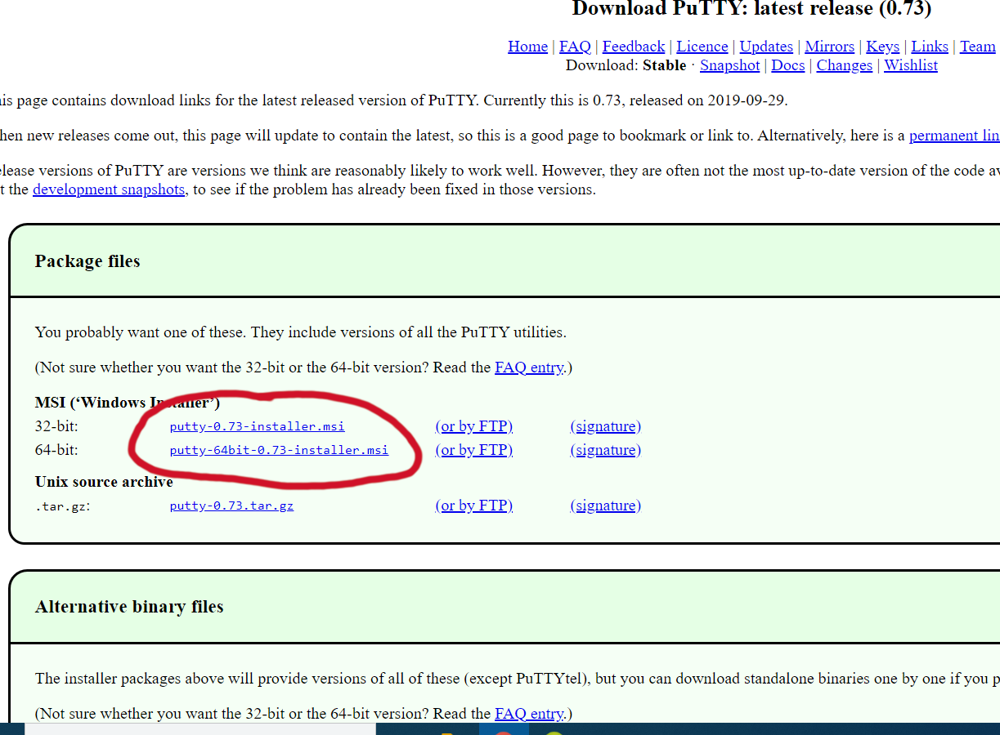

Download the msi file for 32 or 64 bit (depending on your system).

Execute the `.msi` file and follow the installation wizard to complete the
installation. The steps are: click `Next`, choose the desired installation
folder and press `Next`. Lastly you can change the features to include a desktop
shortcut, or simply leave it as it is and press `Install`.

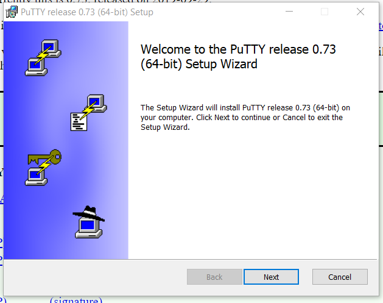

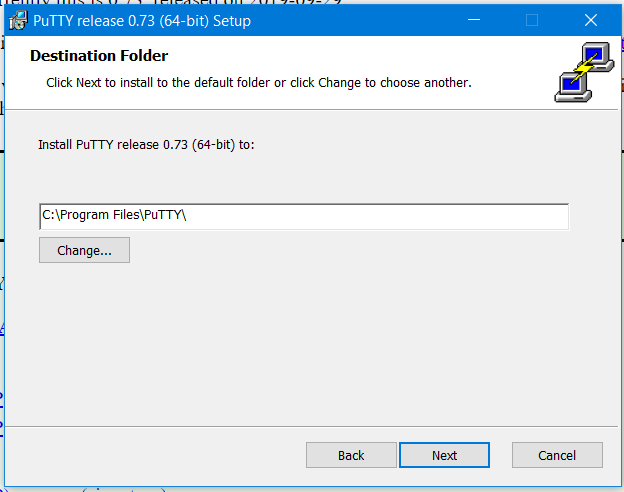

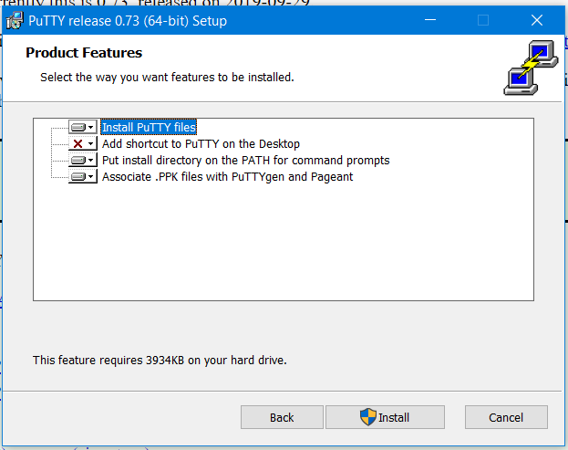

After the installation is complete you can test if the installation was
successful by starting the PuTTY application.

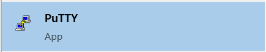

It should open a window that looks like this:

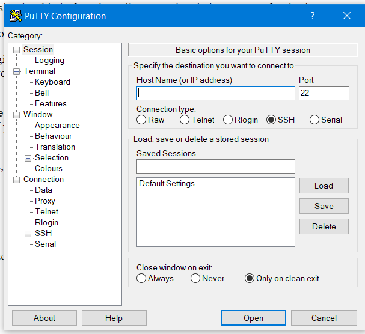

If this opens successfully you can close the window and we can move on to the next step. 


### Step 2: Install `VcXsrv`

`PuTTY` makes it possible to create a remote connection to a university
workstation. However, we also need to enable X11 forwarding to be able to view
graphical display tools like images and GUI’s. This makes it possible to view
images and histograms that are needed / produced during the labs. To do this one
needs to download an X-forwarding client. These instructions use `VcXsrv` that
can be downloaded from this link:
[VcXsrv](https://sourceforge.net/projects/vcxsrv/).

Click the green “Download” button to download an exe file.

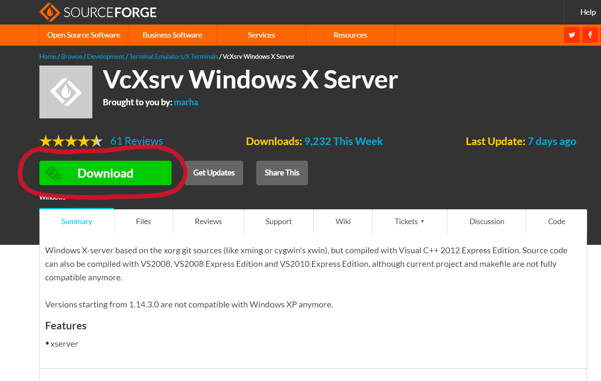

Run the exe file. The installation is from an unknown distributor, so a warning
might appear. If this happens click “Details” and then click “Run”.

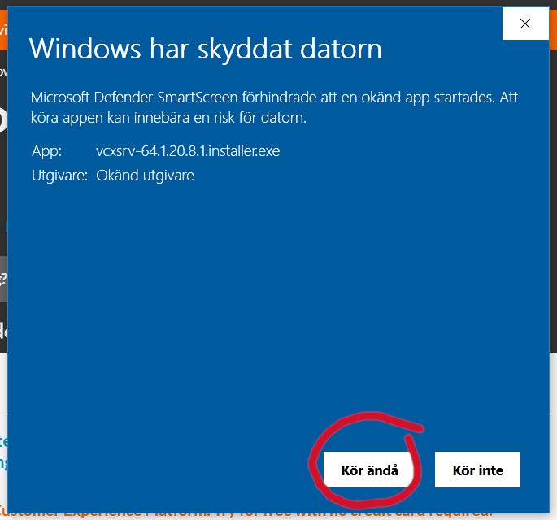

After this the installation wizard should open. I chose to deactivate the
desktop shortcut, if you want this you can simply click “Next” directly.

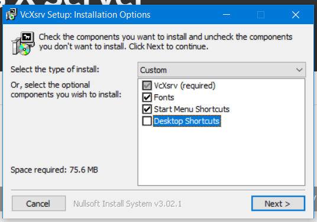

Choose the installation path and click “Install”.

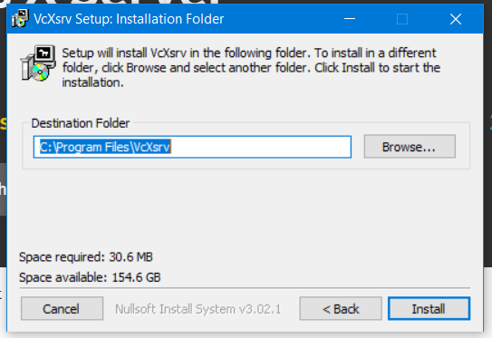

After the installation is complete you should now have the application
“XLaunch”.


### Step 3: Activate X-Forwarding

Open the “XLaunch” application, you should see a window that looks like this:

Make sure the “Multiple Windows” option is ticked and click “Next”.

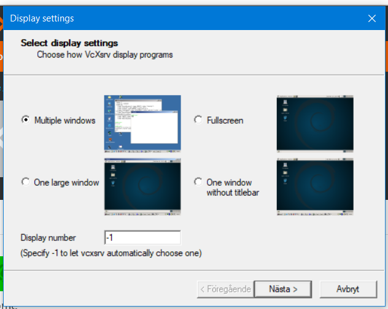

Choose the option “Start no client” and click “Next”.


Leave the default settings and click “Next”.


Lastly press “Complete”.

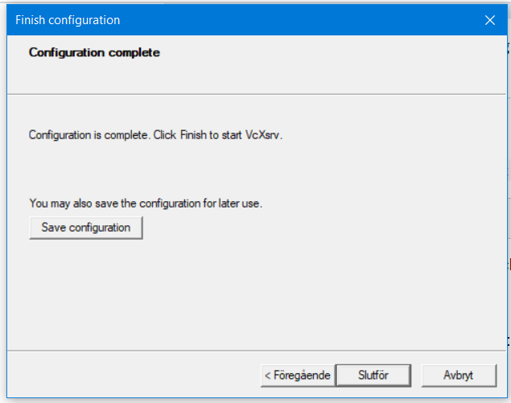

This has started our X-forwarding client. We can now open PuTTY. In PuTTY we
need to activate X11 forwarding however. Go to “Connection → SSH → X11” and click
the “Enable X11 forwarding” option.

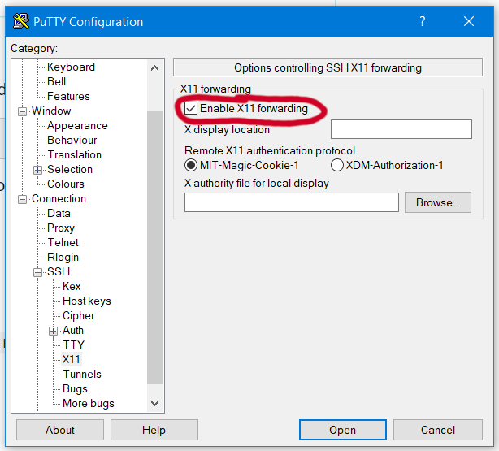

Now you can go back to “Session”.  In “Host Name” you write:
```
<my_user_id>@desktop.physik.uni-bonn.de
```
where you replace `<my_user_id>` with your Uni-ID. After you have filled in the host name you can click on “Open”.

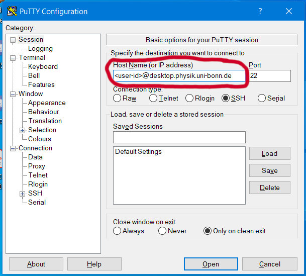

A black console should appear and also a dialogue box. The dialogue box tells
you that the host key is unknown, to add it to our known hosts you click “Yes”.

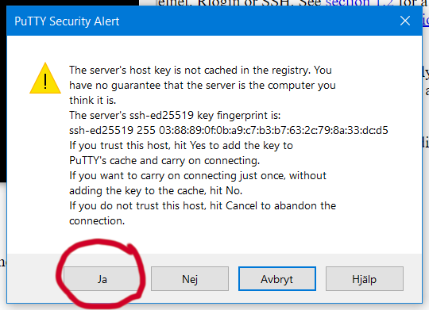

In the black console you will be asked for your Uni-ID password. Type in your
password and press Enter.

After you have logged in you should now be in the home directory of your
university account.

You can type “ls” and press Enter to see what is in the directory.

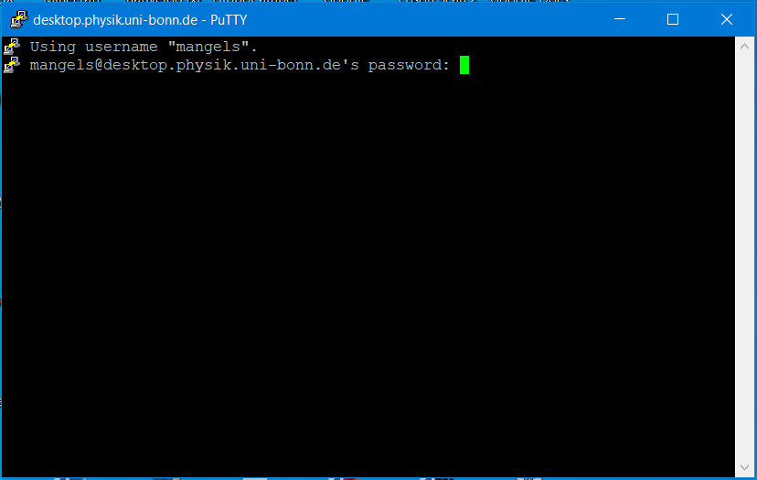

To test if X-forwarding is enabled you can type `xclock` and press Enter. A new
window with a clock should now appear. If the clock does not appear make sure
you ran `XLaunch` and enabled X11 forwarding in `PuTTY` before you connected to the
university desktop.

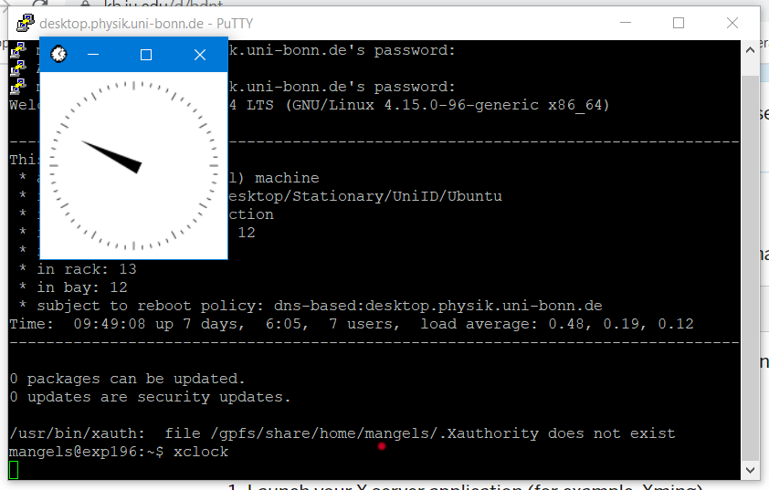

This concludes the setup necessary to be able to perform the lab remotely. If you want you can move on to the next step which explains how you can perform the lab remotely, or you can now exit the SSH session by typing “exit” in the console and pressing Enter.
